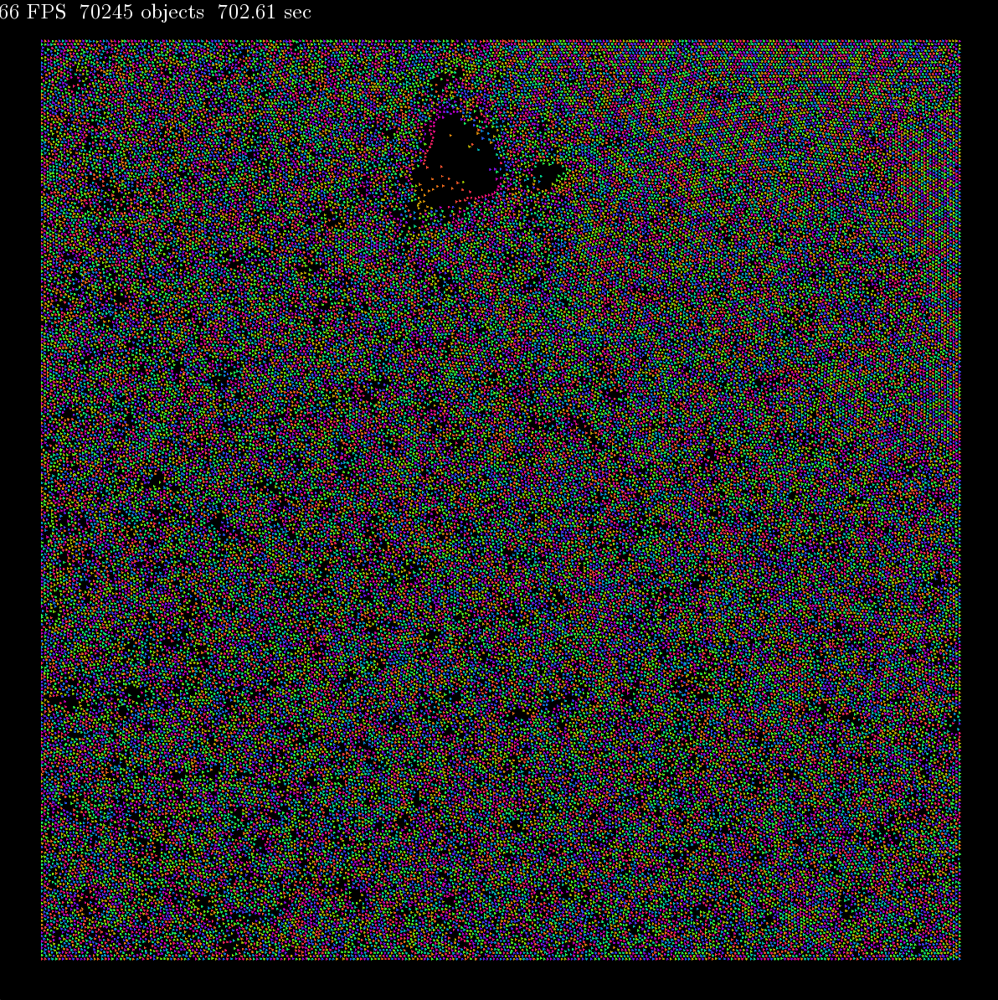
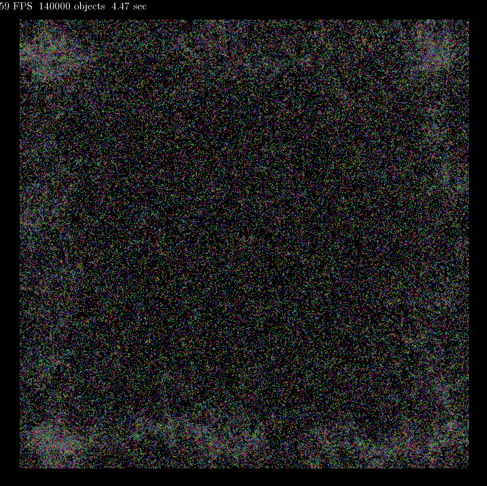
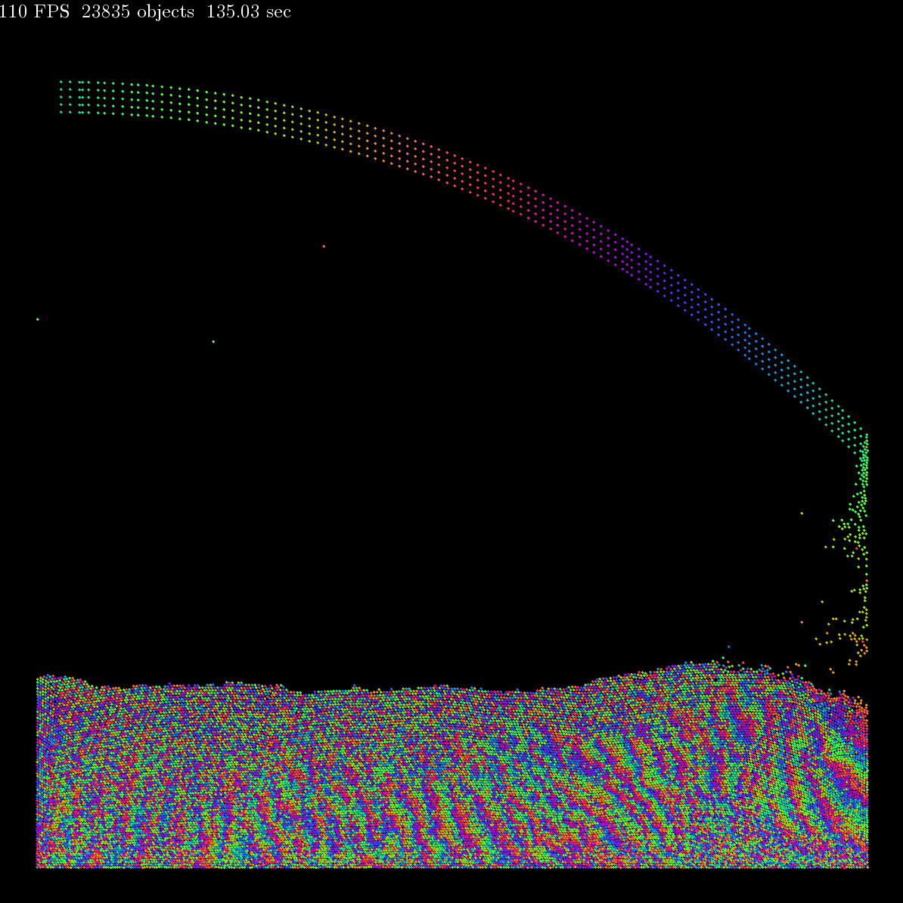

# Spatial Grid Partitioning Collision Detection

Overview: this is an implementation of spatial grid partitioning for more optimized collision detection. I also improved rendering speed by minimizing object creation, avoiding wrapper classes, and reducing draw calls.

Minimum Requirements: 
1. C++17
2. [CMake](https://cmake.org/) 3.10  
3. Have [SFML](https://www.sfml-dev.org/download/) 2.6.2 installed on your computer. Do not use SFML 3.0.0 as they changed a lot of stuff and remember to modify the path to your SFML library in CMakeLists.txt


## Preview

The code (on my machine) can handle up to 21,000 objects at over 60 FPS, 23,000 objects at over 50 FPS, and 30,000 objects at over 40 FPS in release mode. Illustration in the demo below:

[comment]: <> (Hosted with git)
<p align="center">

</p>

However, this performance is affected by the use of `sf::CircleShape`, a non-primitive object. Since each ball requires a separate draw call per frame, and draw calls are relatively expensive operations, performance is limited.

To optimize this, we can store all objects in an array and render them in a single draw call per frame. SFML provides a lower-level mechanism for drawing called `sf::VertexArray`. By approximating small circles with triangles, the simulation can comfortably run at over 60 FPS with 70,000 objects:

<p align="center">

</p>

For even greater performance, we can approximate small circles using an even more primitive type: `sf::Points`. With this approach, the simulation can crank up to 140,000 objects at around 60 FPS:

<p align="center">

</p>

## Build

Create a `build` directory

```bash
mkdir build
cd build
```

**Configure**, **build**, and **run** the project with **release** (recommended)

```bash
cmake --build ./build/ --config Release
./build/Release/grid
```

or with **debug**:

```bash
cmake --build ./build/ --config Debug
./build/Debug/grid
```

Same thing for window, but remember to change to backward slash `\` instead.

## Settings:

To enable gravity, go to `headers/Verlet.h` and change

```c++
sf::Vector2f acceleration = {0.f, 0.f};
```

to

```c++
sf::Vector2f acceleration = {0.f, 150.f};
```
<p align="center">

</p>

To shoot some balls, go to main (grid.cpp) and uncomment the two lines

```c++
//handle_event.dragAndShoot<VerletBall>(event, solver);
//renderer.renderDragArrow(handle_event);
```

## Note:

There are still plenty of optimizations and physics corrections to be made, particularly when a large number of objects are stacked on top of each other with gravity enabled.